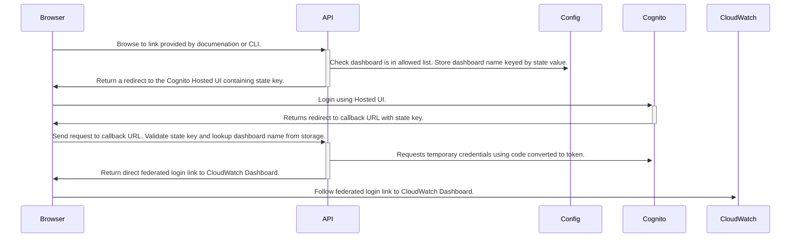

Cognito to CloudWatch Dashboard
===============================

## Goal of this Project

An easy to manage project for streamlining access to CloudWatch Dashboards.

## Flow

The following diagram outlines the flow of requests.

## Configuration

See [defaults.env](/defaults.env) for environment variables.
